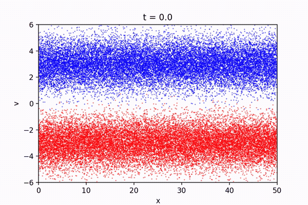
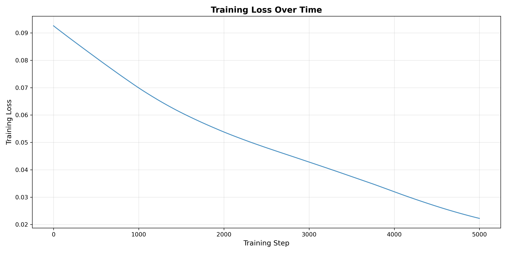
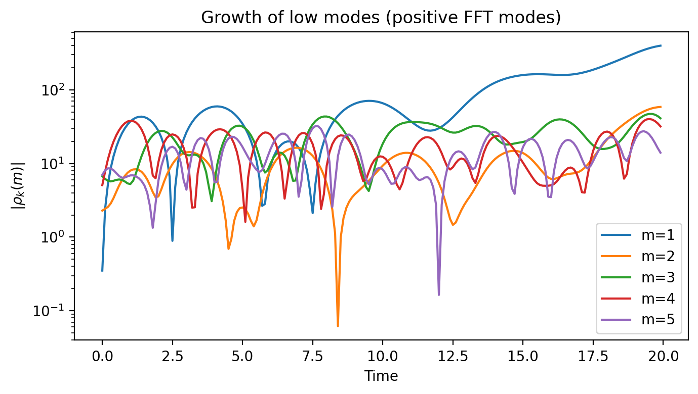
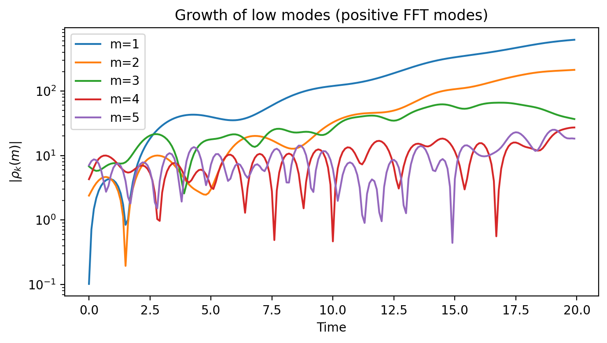
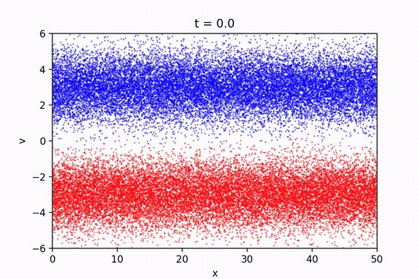

# Differentiable PIC Optimization Tesseract



**PIC simulation with external field optimized for minimum electric field energy.**

Implemented in `pic_simulation.py`. A particle in cell simulation simulates the behavior of a plasma using an Euler-Langrange formulation.
In this formulation, the probability density function is approximated by sampling discrete super-particles from the initial distribution. These particles represent some number of real particles in the plasma. The super-particles interact with external fields while self-consistently influencing each other through the Lorentz force, $m \frac{dv}{dt} = qE + q (v \times B)$. This project implements a 1D particle in cell simulation, simplifying the Lorentz force to $m \frac{dv}{dt} = qE$. The electric potential is found by solving the Poisson equation, $\nabla^2 \Phi = -\frac{\rho}{\varepsilon}$, and the internal electric field is found using the relation $\nabla \Phi = -E$. Both equations are solved by discretizing the problem onto a spatial grid and using the Fast Fourier Transform (FFT). The electric field provides the particle accelerations through the Lorentz equation and a symplectic integrator is used to update the particle positions and velocities using this framework. See section 2.1 of "Regular sensitivity computation avoiding chaotic effects in particle-in-cell plasma methods" for a more in-depth explanation (https://doi.org/10.1016/j.jcp.2019.108969).

PIC (Particle-In-Cell) simulation with Fourier actuator control for plasma simulation. Supports three modes:
- **optimization**: Optimizes the external field and then simulates with the trained external field
- **resp**: Runs simulation with an oscillatory external input (fixed Fourier actuator)
- **zir**: Runs simulation with zero input (no external field)

## Installation
Create a conda environment:
```bash
conda create -n hck_tct python=3.13 jax -c conda-forge    
```

Install runtime dependencies (if running locally):

```bash
pip install tesseract-core tesseract-core[runtime]
```

Build the tesseract:

```bash
tesseract build .
```

## Running the Server

Start the HTTP server:

```bash
tesseract-runtime serve --host 0.0.0.0 --port 8545
```

The API will be available at:
- **API Docs**: http://localhost:8545/docs
- **ReDoc**: http://localhost:8545/redoc

## Simulation Cases

The API supports three different simulation cases:

1. **optimization** (default): Runs gradient-based optimization to find optimal Fourier actuator control parameters that minimize the electric field energy, then simulates with the trained external field.

2. **resp**: Runs a simulation with an oscillatory external input (fixed Fourier actuator control with n=3, m=5, A=1e5) to observe system response to a known control input.

3. **zir**: Runs a simulation with zero input (no external field), with mean-subtracted initial velocities.

## Test Cases

### Optimization case (default)

```bash
curl -X POST http://localhost:8545/apply \
  -H "Content-Type: application/json" \
  -d '{"inputs": {"case": "optimization"}}'
```

### Optimization with custom parameters

```bash
curl -X POST http://localhost:8545/apply \
  -H "Content-Type: application/json" \
  -d '{
    "inputs": {
      "case": "optimization",
      "N_particles": 10000,
      "N_mesh": 200,
      "t1": 10.0,
      "n_steps": 5,
      "lr": 0.05,
      "seed": 42
    }
  }'
```

### Oscillatory external input case (resp)

```bash
curl -X POST http://localhost:8545/apply \
  -H "Content-Type: application/json" \
  -d '{
    "inputs": {
      "case": "resp",
      "N_particles": 40000,
      "N_mesh": 400,
      "t1": 20.0,
      "seed": 0
    }
  }'
```

### Zero input case (zir)

```bash
curl -X POST http://localhost:8545/apply \
  -H "Content-Type: application/json" \
  -d '{
    "inputs": {
      "case": "zir",
      "N_particles": 40000,
      "N_mesh": 400,
      "t1": 20.0,
      "seed": 0
    }
  }'
```

## Input

All parameters are optional (defaults shown):

### Case Selection
- `case`: "optimization" (simulation case: "optimization", "resp", or "zir")

### Simulation Parameters
- `N_particles`: 40000 (number of particles)
- `N_mesh`: 400 (mesh cells)
- `t1`: 20.0 (end time)
- `dt`: 0.1 (timestep)
- `boxsize`: 50.0 (periodic domain size)
- `n0`: 1.0 (electron number density)
- `vb`: 3.0 (beam velocity)
- `vth`: 1.0 (beam width)
- `pos_sample`: false (whether to sample positions randomly)
- `seed`: 0 (random seed)

### Optimization Parameters (only used for "optimization" case)
- `n_steps`: 10 (number of optimization steps)
- `lr`: 0.1 (learning rate)
- `mode_n`: 1 (time mode index for initial FourierActuator)
- `mode_m`: 1 (space mode index for initial FourierActuator)
- `mode_A`: 1e5 (mode amplitude for initial FourierActuator)
- `mode_phi_t`: 0.0 (time phase for initial FourierActuator)
- `mode_phi_x`: 0.0 (space phase for initial FourierActuator)

## Output

All outputs are returned in a JSON object.

### Optimization-specific outputs (only populated for "optimization" case)
- `train_losses`: Training losses at each optimization step (empty array for "resp" and "zir" cases)
- `final_loss`: Final training loss (0.0 for "resp" and "zir" cases)

### Simulation results (all cases)
- `positions`: Particle positions over time (Nt, Np)
- `velocities`: Particle velocities over time (Nt, Np)
- `E_field`: Electric field over time (Nt, N_mesh)
- `E_ext`: External electric field over time (Nt, N_mesh) - zero for "zir" case
- `rho`: Density over time (Nt, N_mesh)
- `momentum`: Momentum over time (Nt, N_mesh)
- `energy`: Energy over time (Nt, N_mesh)
- `ts`: Time array

### Generated Artifacts

The API also generates and logs the following artifacts (saved in the run directory):

- **Plots**:
  - Optimization case: saved in `plots/` subdirectory
  - Resp case: saved in `plots/resp/` subdirectory
  - Zir case: saved in `plots/zir/` subdirectory
  
  Plot files include:
  - `external_field.png`: External electric field visualization (optimization and resp cases only)
  - `scatter.mp4`: Particle scatter animation
  - `density.png`: Density evolution
  - `momentum.png`: Momentum evolution
  - `energy.png`: Energy evolution
  - `density_modes_spectrum.png` and `density_modes_evolution.png`: Density mode analysis
  - `momentum_modes_spectrum.png` and `momentum_modes_evolution.png`: Momentum mode analysis
  - `energy_modes_spectrum.png` and `energy_modes_evolution.png`: Energy mode analysis

- **Model checkpoints** (optimization case only, saved in `model/` subdirectory)

## Showcase

The following visualizations demonstrate the results from different simulation cases:

### Training Loss (Optimization Case)

The optimization case uses gradient-based optimization to minimize the electric field energy. The training loss decreases over optimization steps:



*Note: This shows the training loss for a 5000-step optimization run with all other parameters at default values.*

### Energy Modes Evolution Comparison

Comparison of energy modes evolution between optimized and zero-input cases:

**Optimization Case (5000 steps, default parameters):**


**Zero Input Case (ZIR, default parameters):**


### Particle Scatter Animations

Particle dynamics visualization showing the evolution of the particle distribution:

**Optimization Case (5000 steps, default parameters):**


**Zero Input Case (ZIR, default parameters):**



*Note: The optimization case uses 5000 optimization steps with all other parameters at default values. The ZIR case uses default parameters with zero external field input.*

See API docs at http://localhost:8545/docs for full parameter list.
